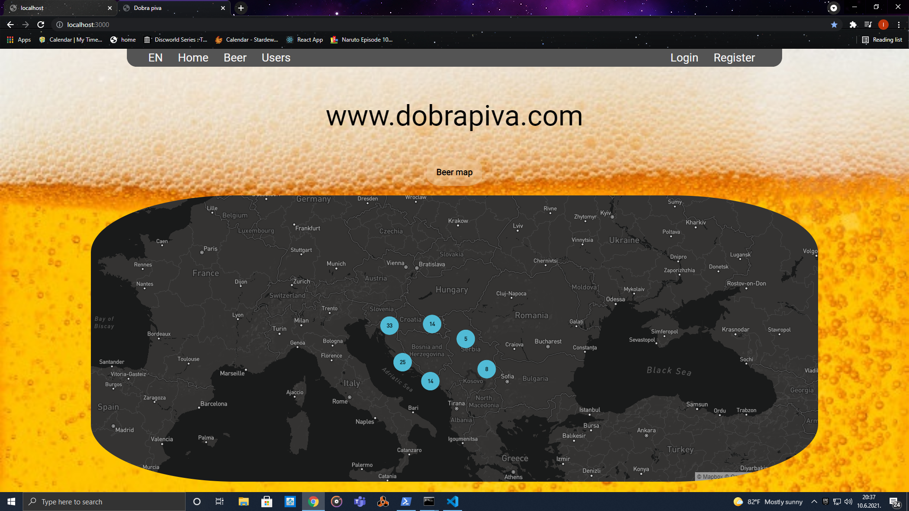
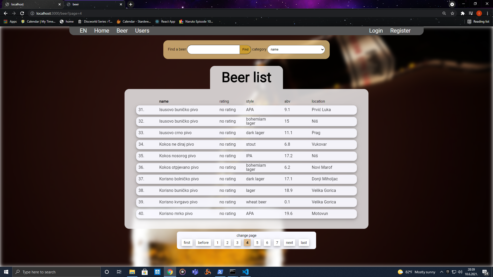
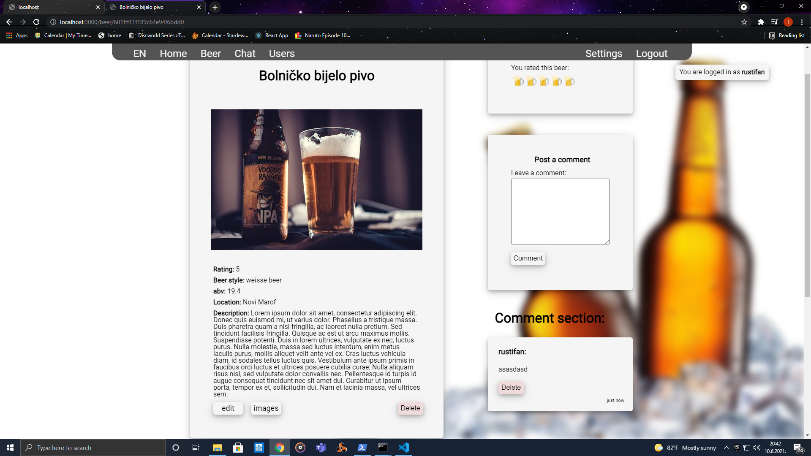
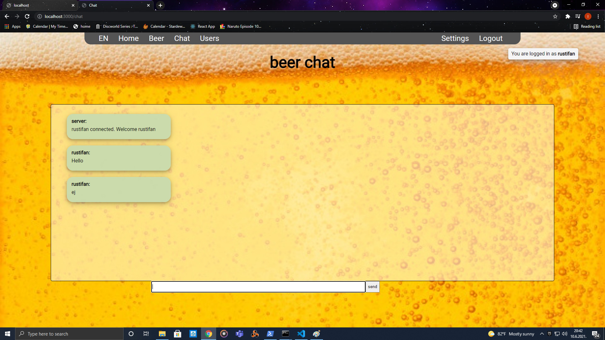

# dobraPiva

Beer rating page

## Images





## Description

dobraPiva.com is a beer reviewing page. 
User can register, and upload his favorite beer. 
You can upload pictures of a beer, add location which will display beer on a map using geolocation.
Added beer must be approved by administrator.
Then other users can browse beer list, leave comments and add rating for every beer.

## Built with

This is a fullstack project developed using:

* nodejs

* express

* ejs

* mongodb

* plain javascript, html and css

* docker 

* haproxy


## Tehnical goals

I built this project to practice building my own technologies.

On backend user Authentication and authorization, as well as password retrieval is built from scratch.

On frontend I avoided using any css or js libraries. (except for map library)

## Prerequisites

* installed npm and nodejs
* install nodemon
* install and run mongodb on default poert
* get cloudinary credentials on [cloudinary.com](https://cloudinary.com/)
* get mapBox key on [mapbox.com](https://www.mapbox.com/)
* get mailgun creds from [mailgun.com](https://www.mailgun.com/)

## Installation

* clone git repo
```
git clone https://github.com/rustifan/dobraPiva.git
```
* cd into project folder
```
cd ./dobraPiva/
```
* run npm install
```
npm install
```
* install nodemon
```
npm i -g nodemon
```
* start mongodb. Download mongodb or run with docker
```
docker run --name mongodb -d -p 27017:27017 mongo
```
* npm start will start server, open project in vs code and chrome with localhost:3000
```
npm start
```

## Env varialbles

create .env file at project root and populate with env variables

* CLOUDINARY_KEY=yourCloudinaryKey
* CLOUDINARY_NAME=yourCloudinaryName
* CLOUDINARY_SECRET=yourCloudinarySecret
* MAPBOX_KEY=yourMapBoxKey
* NODE_ENV=development
* SESSION_PASS=anyPasswordForSession
* MAILGUN_USER=supprot@yourdomain.com
* MAILGUN_PASS=yourMailgunPass

## Optional
you can run it with docker-compose but it is currently configured for production.
So you have to have Certificate for https and free ports 80 and 443.
